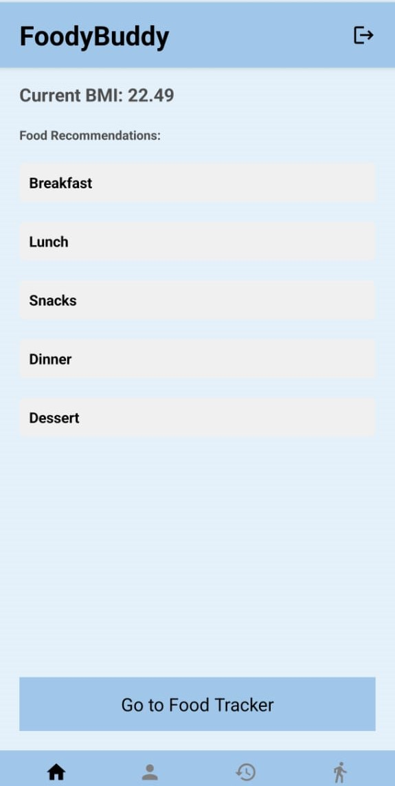
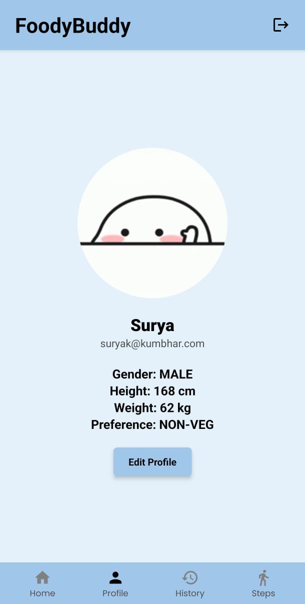
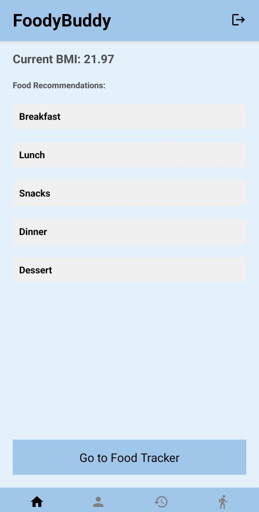
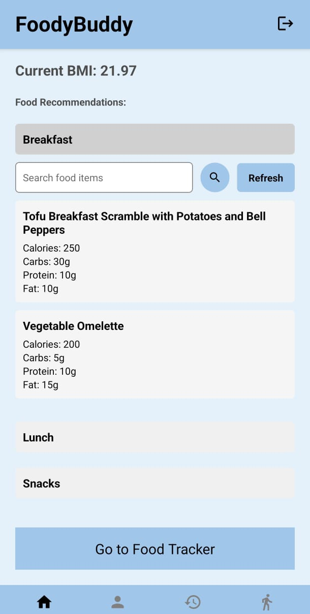
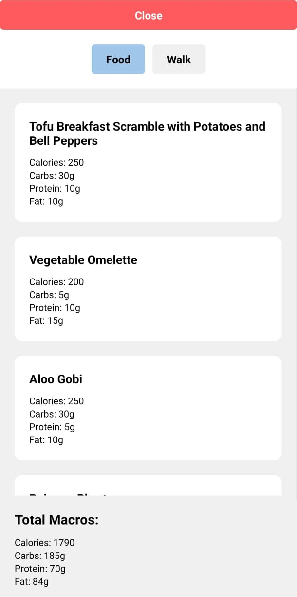
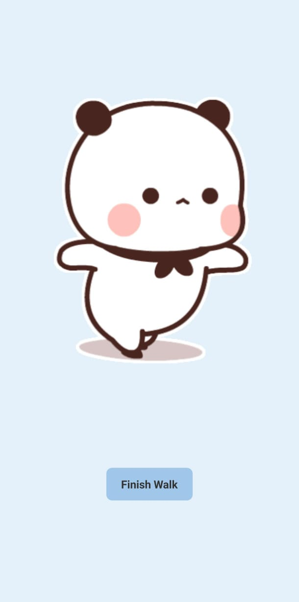
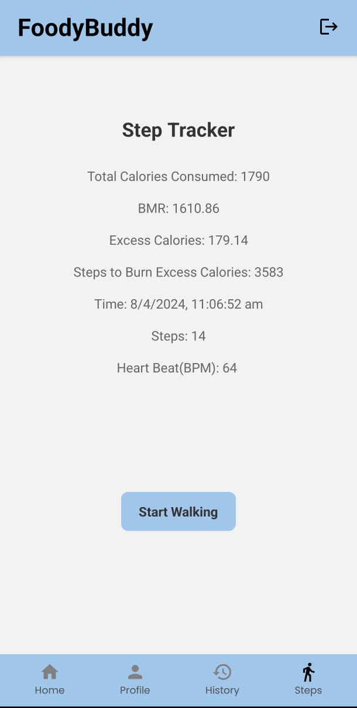

 
<h1 align="center">Foddy Buddy</h1>

Foddy Buddy is a cross-platform mobile application designed to provide personalized food recommendations and track dietary consumption. It helps users make informed dietary choices by analyzing their profile and dietary preferences.

Foddy Buddy is built using <strong>React Native</strong>, <strong>JavaScript</strong>, <strong>Google Firestore</strong> for real-time database solutions, <strong>Redux</strong> for state management, and <strong>Expo</strong> for deployment.

All the data entered by the user is securely stored and synchronized in <strong>Google Firestore</strong>.

Try It Now!!
 
<h3>Features</h3>
<ul>
  <li>Cross-Platform Development: Built with React Native for both iOS and Android.</li>
  <li>Real-Time Database: Utilized Google Firestore for scalable and real-time data handling.</li>
  <li>User Profiling: Personalized embeddings created using user data for tailored food recommendations.</li>
  <li>Dietary Tracking: Track and store detailed macros information for each food item.</li>
  <li>State Management: Efficient and predictable state management with Redux.</li>
  <li>Secure Data Handling: User authentication and data integrity ensured.</li>
  <li>Enhanced UI/UX: Intuitive user interface with custom components and React Native Navigation.</li>
  <li>Continuous Integration: Rapid development cycles and reliable updates with Expo and GitHub Actions.</li>
</ul>
 
<h3>Tech Stack</h3>

  
  
  
  
  

 
<h3>Some Snaps of the App:</h3>
<kbd></kbd>
<kbd></kbd>
<kbd></kbd>
<kbd></kbd>
<kbd></kbd>
<kbd></kbd>
<kbd></kbd>
<kbd></kbd>
 
<h3>Some GitHub Stats</h3>

 
